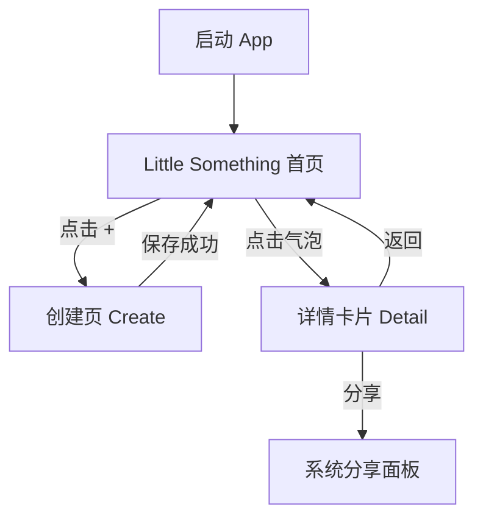
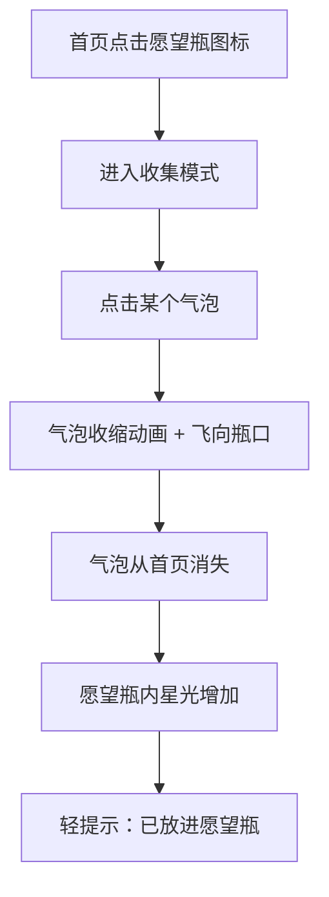
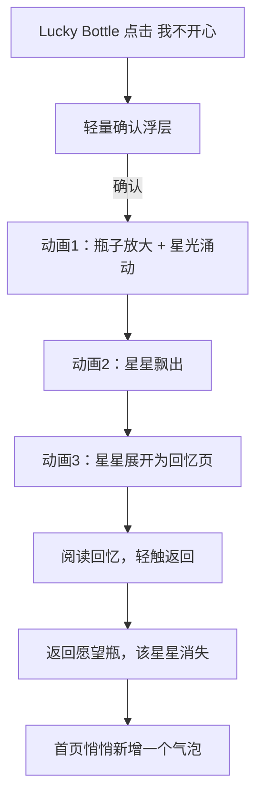

# Little Something PRD（V2）

## 1. 产品概述

Little Something 是一款记录「生活中的小确幸」的情绪向 APP。用户以拍照与文字捕捉日常里那些微小却真实的美好，在首页以梦幻气泡的形式自由漂浮。当你准备好珍藏某个瞬间，把它轻轻送进愿望瓶——它会悄悄变成一颗星星，沉在瓶底，等待被需要的那一天。

当你不开心的时候，轻轻摇一摇愿望瓶，一颗星星会飘出来，展开成当时那段美好的回忆，提醒你：你曾经那么快乐过。

> **核心体验主轴：轻盈记录 → 无感积累 → 温柔被治愈**

---

## 2. 版本范围（V1）

- 平台：iOS + Android
- 存储策略：本地优先，预留可选云同步能力
- 分享方式：系统分享（卡片图 + 文案）
- 收集规则：已收集气泡从首页消失，转化为愿望瓶内的星星；从愿望瓶抽取的星星回忆被打开后，重新变为气泡漂浮回首页
- 安抚策略：点击「我不开心」后随机抽取 1 颗已收藏的星星，展开回忆

---

## 3. 情感设计原则

在所有交互与文案设计中，遵循以下原则：

1. **轻盈，不刻意** — 不强调"打卡""坚持"，记录是自然而然发生的事
2. **惊喜，不透明** — 愿望瓶的内容对用户保持神秘，不展示星星列表，打开才是惊喜
3. **温柔，不说教** — 情绪安抚文案只是陪伴，不评判、不劝导
4. **流动，不割裂** — 页面切换以动画衔接情绪，避免生硬跳转

---

## 4. 功能模块划分

### M1. 记录模块（Create）
- 拍摄 / 选图输入
- 文字输入（轻提示占位文案，如「今天有什么让你小小高兴了一下？」）
- 保存后以气泡生长动画出现在首页，给用户即时的正向反馈
- 支持保存并分享（可选）

### M2. 首页气泡模块（Little Something Tab）
- 气泡随机漂浮，大小略有差异，营造层次感与生命感
- 点击气泡：气泡轻微放大后弹出详情卡片（过渡动画：气泡形态 → 卡片形态）
- 右上角愿望瓶图标：点击进入收集模式
- 底部中央 FAB（+）：进入创建页
- 首页为空时：显示温柔引导文案（如「去记录今天第一个小确幸吧」），无气泡漂浮

### M3. 详情与分享模块（Detail）
- 展示图片、文字、记录时间
- 支持系统分享
- 支持返回上一级（卡片收缩动画返回气泡形态）

### M4. 愿望瓶模块（Lucky Bottle Tab）
- 展示愿望瓶主视觉：瓶中有若干朦胧发光的星星，**不展示具体内容列表**
- 瓶子会有轻微的呼吸感动效（光晕缓慢闪烁）
- 星星数量以瓶内星光密度体现，不以数字或列表呈现
- 「我不开心」入口位于页面显眼但不突兀的位置（图标为不开心 emoji）
- 空态：瓶内无星星时，显示空瓶 + 温柔引导文案（如「先去首页收藏几个小确幸吧，等你不开心的时候，它们会来找你」）

### M5. 情绪安抚模块（Mood Flow）
- 「我不开心」点击后弹出轻量确认浮层（非阻断式弹窗）
- 用户确认后进入沉浸式分镜动画：
  1. 瓶子渐渐占满屏幕，瓶中星光涌动
  2. 一颗星星缓缓飘出瓶口，越来越大
  3. 星星温柔地展开为图文回忆页，伴随文案「不要不开心了，你看，那时候的你有多快乐」
- 回忆详情页阅读完毕后，轻触任意位置可返回愿望瓶
- 返回时该星星在瓶中消失，同时一个新气泡悄悄出现在首页（下次进入首页时可见）

---

## 5. 用户流程图

### 5.1 主流程（记录与浏览）

### 5.2 收藏流程（气泡 → 愿望瓶）

### 5.3 情绪安抚流程

---

## 6. 页面 / 屏幕清单

| 编号 | 路由 | 说明 |
|------|------|------|
| S1 | `Home/Moments` | 小确幸首页（气泡漂浮、愿望瓶入口、FAB、底部 Tab） |
| S2 | `Create/Moment` | 创建页（拍摄/选图、文字输入、保存并分享） |
| S3 | `Detail/Moment` | 详情页（图文内容、分享按钮，无底部 Tab） |
| S4 | `LuckyBottle/Main` | 愿望瓶主页面（瓶子视觉、我不开心按钮、底部 Tab） |
| S5 | `LuckyBottle/Empty` | 愿望瓶空态（无星星时的温柔引导） |
| S6 | `Home/CollectMode` | 首页收集态（轻提示引导点击气泡收藏） |
| S7 | `Home/AfterCollect` | 收藏后反馈（气泡飞向瓶口动画 + 短暂提示） |
| S8 | `Mood/Confirm` | 不开心确认浮层（轻量非全屏） |
| S9 | `Mood/Anim_BottleExpand` | 安抚分镜1（瓶子放大，星光涌动） |
| S10 | `Mood/Anim_StarFly` | 安抚分镜2（星星飘出并放大） |
| S11 | `Mood/MemoryReveal` | 安抚分镜3 / 回忆详情页（图文 + 陪伴文案） |

---

## 7. 交互说明

### 7.1 首页交互
- 气泡自然漂浮，点击气泡展开详情卡片（气泡形态平滑过渡为卡片）
- 详情卡片关闭时，以卡片收缩动画回归气泡形态，位置基本不变
- 右上愿望瓶图标点击 → 进入收集模式，界面出现轻柔提示光环
- 底部 FAB（+）点击 → 进入创建页（无底部 Tab）

### 7.2 创建交互
- 创建页不显示底部 Tab，保持专注
- 文字输入框占位文案温柔，随机展示多条（如「今天让你笑了一下的事？」「有什么小小的满足？」）
- 保存成功后：淡出创建页 → 新气泡从画面中央生长出现 → 融入首页漂浮队列

### 7.3 收集交互
- 进入收集模式后，现有气泡出现轻微光晕提示「可点击收藏」
- 点击气泡：气泡缩小 → 以抛物线弧度飞向右上角愿望瓶图标 → 消失
- 收藏动作结束后，愿望瓶图标短暂闪光，提示已收入
- 支持连续收集多个，无需退出模式

### 7.4 愿望瓶交互
- 瓶内星光以柔和动效持续呼吸，不展示星星列表，**内容保持神秘**
- 用户无法从愿望瓶页面直接查看每颗星星对应的内容，只有通过「我不开心」才能随机触发一颗
- 星星数量多时，瓶内光点更密集；数量少时，星光更稀疏

### 7.5 情绪安抚交互
- 点击「我不开心」后弹出轻量浮层（非全屏遮罩），语气温柔（如「要让愿望瓶帮你找找快乐吗？」）
- 确认后：进入沉浸式分镜动画（隐藏底部 Tab）
- 动画结束进入回忆详情页，顶部文案「不要不开心了，你看，那时候的你有多快乐」
- 回忆详情页底部提供「轻轻放回去」按钮，点击后：星星从屏幕消失，返回愿望瓶
- 对应星星重新转化为气泡，下次进入首页时出现

### 7.6 异常与空态
- 相机权限拒绝：温柔提示「需要相机权限，或者用相册里的照片也可以」
- 分享失败：轻提示失败，可重试，不打断整体流程
- 愿望瓶无星星时点击「我不开心」：空瓶动效 + 温柔文案「瓶子还是空的，先去收藏几个小确幸吧，它们以后会来陪你」
- 图片加载失败：显示柔和占位色块，不展示错误图标，减少视觉割裂感

---

## 8. 关键动效说明

| 场景 | 动效描述 | 时长参考 |
|------|---------|---------|
| 气泡漂浮 | 随机方向缓慢漂移，轻微形变 | 持续循环 |
| 气泡点击展开 | 气泡形态平滑扩展为圆角卡片 | 300ms |
| 详情卡片关闭 | 卡片收缩回气泡，回归原位 | 250ms |
| 气泡保存出现 | 从中央缩放生长 → 漂浮 | 400ms |
| 气泡飞入瓶口 | 缩小 + 弧线路径 + 消失 | 500ms |
| 愿望瓶呼吸光晕 | 透明度和光晕半径缓慢循环 | 3s / 循环 |
| 安抚分镜1 | 瓶子从页面中心放大至满屏 | 800ms |
| 安抚分镜2 | 星星从瓶口飘出并放大 | 600ms |
| 安抚分镜3 | 星星展开为图文页，带透明度渐显 | 500ms |

---

## 9. 文案情感基调

- **创建页占位文案**（随机展示）：
  - 「今天有什么让你小小高兴了一下？」
  - 「有什么小小的满足，值得被记住？」
  - 「此刻的心情，值得被留下来。」

- **收藏成功提示**：「放进去了，等你需要的时候再来找你。」

- **愿望瓶空态**：「先去首页收藏几个小确幸吧，等你不开心的时候，它们会来找你。」

- **不开心确认浮层**：「要让愿望瓶帮你找找快乐吗？」

- **回忆详情页顶部**：「不要不开心了，你看，那时候的你有多快乐。」

- **回忆返回按钮**：「轻轻放回去」

---

## 10. 数据对象（V1）

### Moment（小确幸）
- id
- photoUri
- text
- createdAt
- status（`active` | `collected`）

### Star（愿望瓶星星）
- id
- momentId
- collectedAt

---

## 11. 验收标准（UAT）

- **记录链路**：可从首页进入创建页，保存后回到首页并看到新气泡以生长动画出现
- **浏览链路**：气泡点击展开详情，详情关闭后气泡回到原位，支持分享
- **收藏链路**：气泡飞入瓶口动画完成，首页对应气泡消失，愿望瓶内星光增加，持久化存储
- **愿望瓶链路**：愿望瓶页面不展示星星列表，仅以星光密度呈现数量感
- **安抚链路**：弹窗 → 三段分镜动画 → 回忆详情 → 返回，全链路完整可达，返回路径正确
- **导航链路**：Home 与 Lucky Bottle 双 Tab 切换流畅，Create / Detail / Mood 动画流程不显示 Tab
- **视觉一致性**：字号层级统一、动效时长自然不突兀、空态文案温柔不生硬
